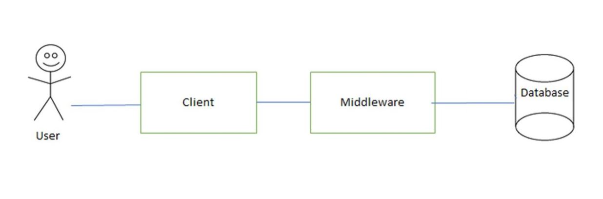
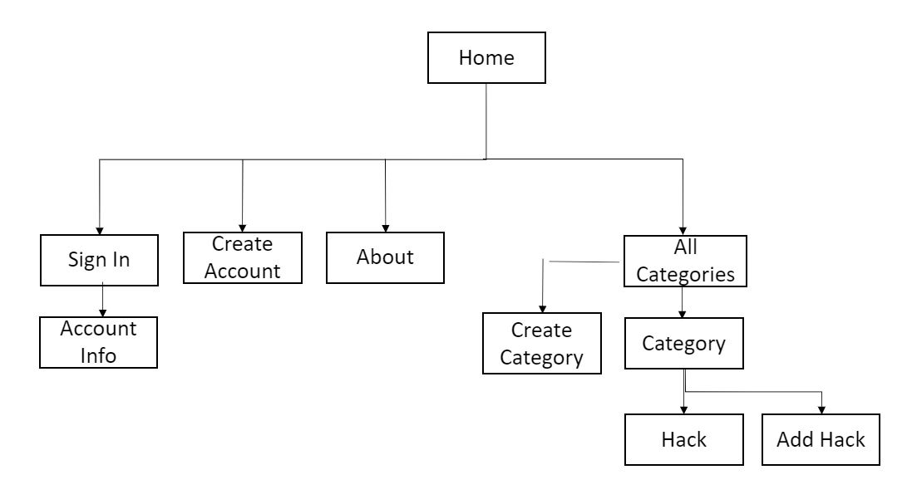
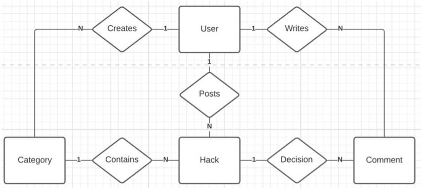

# WAD2 LifeHackForum
Team: 14B \
Web Application Development Team Project: A Lifehack Forum \
Course link: https://www.gla.ac.uk/coursecatalogue/course/?code=COMPSCI2021 \
Status: Completed

## Design Specifications
Our web application is a blog-style site where users can view and post useful lifehacks in a variety of different categories. The site features a ranking feature for these lifehacks which allow for the most popular lifehacks and categories to appear at the top of the page.

## Get Started
Python requirements:
- Set up Python (>=3.5) virtual environment 
- Install requirements

Set up once:
- Run "python manage.py -makemigrations" to make changes
- Run "python manage.py -migrate" to migrate changes
- Run "python populate.py" to populate the database with sample data

Then you are set to run the server:
- Run "python manage.py -runserver" to start the server
- Access the website at http://127.0.0.1:8000/

## System Design
System Architecture Diagram: 

Site Map:

Entity-Relationsip Diagram in Compressed-Chen Notation: 

